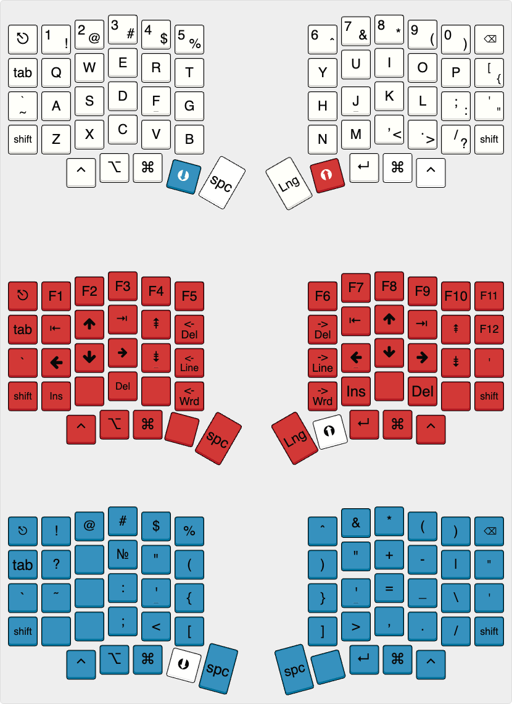

# Sofle Custom RU — прошивка для QMK с поддержкой macOS, Windows и Linux

Прошивка предназначена для эргономичной split-клавиатуры Sofle RGB v2 (MX) 
на контроллерах RP2040, ориентированной на многоязычную с английской и русской раскладками. Поддерживается автоматическое переключение
раскладки в ОС, эффективный ввод специальных символов через комбо, залипающие 
шифты, RGB-подсветка, OLED-дисплей.

## Требования к железу

Платы: Sofle RGB v2 проводная версия.  
Контроллеры: Pro Micro RP2040  
Дополнительно:  
2× OLED-дисплея  
2× энкодера  
RGB-светодиоды на кажой клавише  
Резистор на GP4 для автоматического определения стороны (левая/правая)  
Инструкция по сборке: [PandaKB Sofle Build Guide](https://pandakb.com/guides/sofle-rgb-mx-build-guide/)  
Плата на которой разработана прошивка была куплена в магазине `MiFuny`  

## Возможности прошивки

### Умное переключение раскладки (lang_shift + Karabiner / AutoHotkey)

Прошивка использует модифицированную версию плагина [lang_shift](https://github.com/konst2/lang_shift-mac) в котором добавлен способ управления раскладкой методом `LANG_CHANGE_CARABINER`.  

#### Принцип работы

При необходимости переключения языка по клавише переключения раскладки или ввода символа из другой раскладки, прошивка автоматически отправляет `F18` или `F19`, которые ОС интерпретируют как команду смены раскладки. Клавиши разные для каждого языка, что
решает проблему рассинхронизации между клавиатурой и ОС которая возникала в недоработанной версии плагина -- текущий язык клавиатуры практически всегда совпадает с системным.

#### Настройка OS

- MacOS  
Установите [Karabiner-Elements](https://github.com/pqrs-org/Karabiner-Elements).  
Далее надо добавить 2 правила через  
Settings -> Complex Modification -> Add Your Own Rule:  
 1.  
```json
{
    "description": "F19 -> переключить на английский (даже с Shift/Ctrl и др.)",
    "manipulators": [
        {
            "from": {
                "key_code": "f19",
                "modifiers": { "optional": ["any"] }
            },
            "to": [{ "select_input_source": { "language": "en" } }],
            "type": "basic"
        }
    ]
}
```

 2.  
```json
{
    "description": "F18 -> переключить на русский (даже с Shift/Ctrl и др.)",
    "manipulators": [
        {
            "from": {
                "key_code": "f18",
                "modifiers": { "optional": ["any"] }
            },
            "to": [{ "select_input_source": { "language": "ru" } }],
            "type": "basic"
        }
    ]
}
```
>Для русского языка в macOS обязательно замените раскладку на "Русский — PC", (вместо "Русский" установленный в системе по умолчанию). 

- Windows 11.  
Установить утилиту [Autohotkey V2](https://www.autohotkey.com/)  
В папке автозапуска Windows следует создать файл `lang_shift.ahk` в котором:  
```
; Переключение на английский по F19 (игнорируя модификаторы)
*$F19::{
    SetInputLang("00000409") ; en-US w11
}

; Переключение на русский по F18 (игнорируя модификаторы)
*$F18::{
    SetInputLang("00000419") ; ru-RU w11
}

; Функция установки раскладки (для AHK v2)
SetInputLang(LocaleID) {
    hWnd := WinGetID("A") ; активное окно
    threadID := DllCall("GetWindowThreadProcessId", "Ptr", hWnd, "Ptr", 0, "UInt")
    hkl := DllCall("LoadKeyboardLayout", "Str", LocaleID, "UInt", 1, "Ptr")
    if (!hkl)
        return
    ; Отправляем сообщение для смены раскладки в поток окна
    DllCall("PostMessage", "Ptr", -1, "UInt", 0x50, "Ptr", threadID, "Ptr", hkl)
}
```

>Тут `00000409` и `00000419` id русской и английской раскладок в системе.  Если вдруг возникнут проблемы их можно посмотреть в `PowerShell`  
```
Get-WinUserLanguageList | ForEach-Object {
    Write-Host "Язык: $($_.LanguageTag)"
    $_.InputMethodTips | ForEach-Object { Write-Host "  Раскладка: $_" }
}
```

- Linux.  
Аналогично, перехват F18/F19.  
F18 - переключение на русскую раскладку.  
F18 - переключение на английскую раскладку

### Раскладка слоёв.  

[Keyboard Layout Editor](https://www.keyboard-layout-editor.com/#/gists/26ca3f92825312924ce738406f96e0a4)



`Красный слой` `RAIZE` -- навигация.  
`Синий слой` `LOWER`-- знаки. Однако гораздо удобнее пользоваться комбо (см ниже) на которых сейчас все эти знаки есть, поэтому клавиша синего слоя перенесена подальше от большого пальца.  

TODO: добавить слой _ADJUST (настройка ОС, RGB)


## Управление активной в OS раскладкой


## Комбо

## Залипающий Shift

Оба Shift работают так:  
- если Shift зажат как обычно, и во время его зажатия были введены какие-либо символы, то считаем, что это обычный Shift.  
- если Shift был однократно нажат, то он срабатывает к одной следующей клавише. Бывает удобно нажать перед заглавной буквой, если она одна. 

## Поддержка разных OS

## Перемещение по словам и удаление по словам

## Включение/выключение слоя навигации

## RGB подсветка

## OLED дисплеи

## TriLayer

## Энкодеры

# Ссылки

Модифицированный плагин lang_shift
https://github.com/konst2/lang_shift-mac


Panda layouts:
https://github.com/PandaKBLab/QMK-firmware-for-keyboards/tree/main/sofle/sofle
